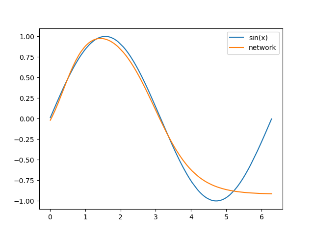

# neural-networks
Learning neural networks from scratch, without any libraries or abstractions. Pure mathematics!!

## XOR operation using finite difference gradient descent
```
Network = 2-2-1
Rate: 1e-1
Eps: 1e-3
Iterations: 10000

Randomized initialization:
[
	layer[1]: 
		Weights [
			[0.10397148 0.35314678] 
			[0.72151571 0.22562783] 
		]
		Biases [
			0.6237433355905243 
			0.6047149341374166 
		]
	layer[2]: 
		Weights [
			[0.94829035] 
			[0.1645068] 
		]
		Biases [
			0.17306031088569518 
		]
]

Cost: 1.20619723236888 => 0.0038727474566097814
----------------------------

[
	layer[1]: 
		Weights [
			[6.18137884 4.14800897] 
			[6.16171423 4.14368296] 
		]
		Biases [
			-2.680936728821352 
			-6.365563164648691 
		]
	layer[2]: 
		Weights [
			[8.53527884] 
			[-9.25595301] 
		]
		Biases [
			-3.889945698548989 
		]
]

0 + 0 = [0.03361273]
0 + 1 = [0.97026304]
1 + 0 = [0.97029991]
1 + 1 = [0.0312498]

in 33.476 seconds
```

## Check if a point lies in a circle
```

[
	layer[1]: 
		Weights [
			[ 0.72658998 -0.25930513 -0.24009926  0.57823633] 
			[ 0.4998994  -0.63354291  0.38804025  0.04183064] 
		]
		Biases [
			0.0 
			0.0 
			0.0 
			0.0 
		]
	layer[2]: 
		Weights [
			[0.41398668] 
			[0.0397259] 
			[-0.39365195] 
			[-0.2861647] 
		]
		Biases [
			0.0 
		]
]

Cost: 0.24886695959615662 => 0.02484119569626647
----------------------------

[
	layer[1]: 
		Weights [
			[ 3.76039613 -2.84707772 -0.03000232  0.86292261] 
			[-0.69209557 -2.72567257  0.06582743 -3.95856896] 
		]
		Biases [
			2.154414513868197 
			1.8738691801987364 
			1.8233908757486745 
			-2.0208738180361503 
		]
	layer[2]: 
		Weights [
			[5.38052827] 
			[5.1435482] 
			[-3.11577005] 
			[-4.7955255] 
		]
		Biases [
			-5.2492926380088 
		]
]


[Done] exited with code=0 in 63.194 seconds
```

## Estimate sin function
[sin.py](07-sin.py)

